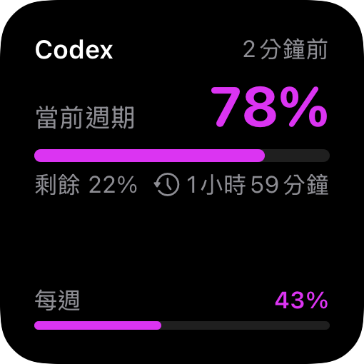
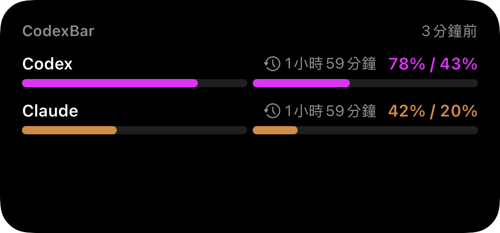

# 056 — Usage Bars Widget

**Status:** done
**Date:** 2026-09-23
**Branch:** `feat/usage-bars-widget` (stacked on `fix/provider-color-contrast`)

## Goal

A second home-screen widget styled after quota trackers like Nowdex: dark
card, provider brand color, one bar per rate window (5-hour / weekly / …),
used percentage, and a live "resets in" countdown. The existing
`CodexBarStatusWidget` (overview / cost / sync health) stays unchanged.

## Findings

- `CodexBarMobileWidgets` already exists and fetches CloudKit directly in its
  timeline (`CodexBarWidgetTimeline.swift`); no App Group hand-off is needed.
- `CodexBarWidgetProviderSummary` only carries one collapsed `usagePercent`
  (max over windows + budget). Per-window data (`SyncRateWindow.label`,
  `usedPercent`, `resetsAt`) is dropped in `CodexBarWidgetSnapshotBuilder`.
- Window labels are localized by `ProviderWindowLabel` and provider tints by
  `ProviderColorPalette`; both live in the app target but only need
  Foundation/SwiftUI/CodexBarSync.

## Design

### Data

- New `CodexBarWidgetUsageWindow { label, usedPercent, resetsAt }`.
- `CodexBarWidgetProviderSummary` gains optional `windows` and
  `tintHex`. Optional + defaulted, so existing call sites and the preview
  snapshot keep compiling; the snapshot is rebuilt in-process each timeline,
  so there is no persisted-format migration.
- Labels are localized when the summary is built, using the same fallback
  names as the Usage tab (Session / Weekly / Limit N).

### Shared code moves (fork-owned files only)

- `MobileLocalizedString` + `ProviderWindowLabel` move from
  `Views/V045ProviderCards.swift` to `CodexBarWidgetShared/ProviderWindowLabel.swift`.
- `Models/ProviderColorPalette.swift` moves to `CodexBarWidgetShared/`.
  `CodexBarWidgetShared/` is compiled into both the app and widget targets,
  so no `project.yml` change is needed.

### Widget

- New `CodexBarUsageBarsWidget` (own kind + own intent) in new files;
  `CodexBarWidgets.swift` gains one registration line.
- Intent parameter: optional provider (`AppEntity` + `EntityQuery` backed by
  the same CloudKit fetch). Empty = the provider with the highest usage.
- **Small:** provider name + last-sync time; headline window (highest used)
  as a big percentage with bar, used/remaining, reset countdown; up to two
  more windows as compact label + percent rows.
- **Medium:** up to three providers (selected one first), each row: name,
  highest percent, one bar per window (max 2), reset countdown of the
  headline window.
- Always dark (`.colorScheme(.dark)` + black container) so the dark-mode
  tint lift from `ProviderColorPalette.readable` applies.
- Reset countdown uses `Text(date, style: .relative)`, which ticks without
  extra timeline entries.

### Out of scope

Lock-screen accessory families, large/extra-large layouts, per-window
selection. Add when asked.

## Verification

- Builder test `keeps every provider and its rate windows for the usage bars widget`.
- Rendered with `ImageRenderer` from a throwaway test (zh-Hant simulator):
   
- Not yet verified on a real home screen / live CloudKit data.
- Pre-existing, unrelated failures in `WidgetSnapshotBuilderTests` (Today cost
  display: 3 tests) reproduce on the base commit without this change.

## Upstream conflict surface

`steipete/CodexBar` has no iOS code, so upstream syncs never touch these
files. Within the fork, edits to existing files are limited to: the summary
struct/builder, the widget bundle (1 line), and the two file moves.
